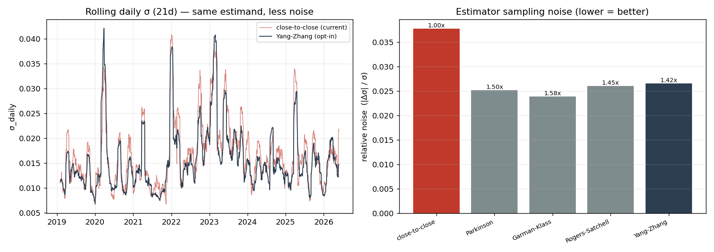
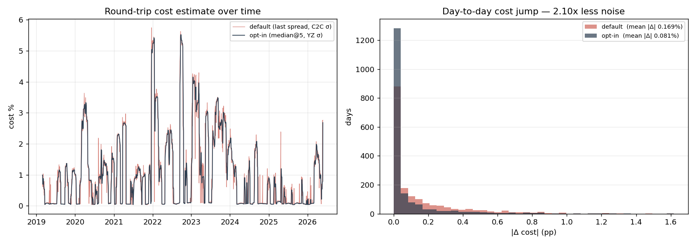

# Ballast - Systematic BIST Portfolio Maintenance Toolkit

[](https://github.com/caganco/ballast-bist/actions/workflows/ci.yml)


[](LICENSE)

A disciplined, test-covered toolkit for running a long-horizon BIST equity/cash
portfolio: it computes the initial allocation, generates band-triggered rebalance
signals, models round-trip transaction costs from daily OHLC data, and produces
inflation-adjusted (TL-real) performance reports.

**Design boundary:** the toolkit *computes actions* - target lots, rebalance
direction, cost estimates. It **never executes trades**. Orders are placed manually
in the broker; this codebase is the analytics and decision layer.



---

## Why it exists

Most retail portfolio "systems" fail in two predictable ways: they overfit a
backtest, and they react to daily noise. This toolkit is built to avoid both.

- **Pre-registered, falsifiable measurement.** Strategy parameters (target ratio,
  rebalance band, instrument) are frozen *before* measurement; results are reported
  as raw numbers without post-hoc tuning.
- **Calibration, not curve-fitting.** Recent work reduced the *sampling noise* of
  the cost-estimation tools without changing their estimand - every calibration is
  opt-in and the default path is byte-for-byte identical to the prior behavior
  (regression-tested). See [Calibration](#calibration-low-variance-cost-estimation).
- **Cost realism.** Transaction costs come from an academic OHLC spread estimator
  (Abdi-Ranaldo 2017) and a square-root market-impact model (Kyle 1985 / Almgren
  2005), not a hand-waved flat fee.
- **Behavioral discipline by construction.** The rebalance policy is *band-triggered
  only* - never calendar-triggered, never discretionary. Inside the band, the
  correct action is to do nothing.

---

## Architecture

```
ballast/
├── costs/
│   ├── transaction_cost_v2.py   # Abdi-Ranaldo spread + Kyle impact + tax utilities
│   └── volatility.py            # low-variance OHLC σ estimators (Parkinson, GK, RS, Yang-Zhang)
├── portfolio/
│   ├── setup_calculator.py      # initial lot/cash split (whole-lot floor)
│   ├── rebalance_check.py       # band-triggered AL/SAT/HOLD signal
│   ├── rapor_uret.py            # TL-real / USD-real / index-relative reporting
│   ├── state.py                 # JSON state load/save (real holdings git-ignored)
│   └── __main__.py              # operational CLI
├── data/                        # yfinance + TCMB/EVDS ingestion (prices, CPI, FX)
└── utils/                       # config, logging
```

| Layer | Responsibility |
|---|---|
| `costs` | Per-trade cost estimation from daily OHLCV; volatility calibration |
| `portfolio` | Allocation arithmetic, rebalance policy, reporting, state, CLI |
| `data` | Market data (XU030/XU100), CPI (TÜFE), FX (USDTRY) retrieval with retry/guards |

---

## CLI

Installed as a module entry point - computes actions only, never trades.

```bash
# Initial allocation for a 300,000 TL portfolio (live ZPX30 price)
python -m ballast.portfolio setup --total 300000

# Band-rebalance signal (holdings read from state, live price)
python -m ballast.portfolio check

# Periodic TL-real performance report
python -m ballast.portfolio report
```

Example:

```
$ python -m ballast.portfolio check --lot 1600 --price 198 --cash 10000
Equity ratio   : 96.94%  (target 87.5% ± 7.5%)
Deviation      : +9.44 pp
Signal         : SAT  155 lots  (~30,850.00 TL)

Action: execute the direction/lots above manually. No trade is executed here.
```

---

## Calibration: low-variance cost estimation

The cost tools' two noisiest inputs were re-estimated with lower sampling variance,
**preserving the estimand** (the quantity measured is unchanged - only the estimator's
day-to-day jitter drops). Measured on real XU030 OHLC, 2019-2026 (1,835 days):

| Component | Before (default) | After (opt-in) | Noise reduction |
|---|---|---|---|
| Daily volatility (Kyle σ input) | close-to-close std | **Yang-Zhang** OHLC estimator | **1.42×** |
| Spread point estimate (round-trip) | last day (`iloc[-1]`) | **trailing median (5d)** | **2.10×** |

Yang-Zhang is chosen over lower-noise alternatives (Garman-Klass) specifically
*because* it retains the overnight variance term - its level matches close-to-close
(ratio 0.932), so it estimates the **same** σ, just with less noise. Estimators that
drop overnight variance were rejected: they reduce noise by shifting the estimand,
which would change the methodology.



All calibration is **opt-in**; default calls return the original numbers
(`rel=1e-12` regression tests). Full write-up: [`results/calibration_report.md`](results/calibration_report.md).

```python
from ballast.costs.transaction_cost_v2 import round_trip_cost_v2

# Default - original behavior, unchanged
round_trip_cost_v2(close, high, low, order_value, adv)

# Opt-in - lower-variance estimators, same estimand
round_trip_cost_v2(
    close, high, low, order_value, adv,
    sigma_method="yang_zhang", open_=open_,   # 1.42x less σ noise
    spread_agg="median", agg_window=5,         # 2.10x less spread noise
)
```

---

## Install

```bash
pip install -e ".[dev]"     # runtime + dev tooling (pytest, ruff, mypy, matplotlib)
```

Market-data credentials (TCMB/EVDS for CPI) go in `.env` (see `.env.example`).

## Quality

```bash
pytest tests/      # 69 tests - pure-logic, synthetic data, no live calls
ruff check .       # lint + import order
mypy               # type-checks costs/ and portfolio/ (gradual adoption)
```

CI runs all three on Python 3.11 and 3.12 (`.github/workflows/ci.yml`).

## Reproduce the calibration study

```bash
python scripts/calib_research.py        # noise diagnostics (read-only)
python scripts/calib_backtest_delta.py  # default vs opt-in cost delta
python scripts/calib_plots.py           # regenerate results/*.png
```

---

## Scope (deliberately excluded)

- ✗ Trade execution - the toolkit outputs direction/lots; the human places orders.
- ✗ Alpha generation, timing signals, factor tilts - this is a *maintenance* system.
- ✗ Calendar-triggered rebalancing - band-triggered only.
- ✗ Personal holdings in version control - real `portfoy_state.json` is git-ignored;
  only the `*.example.json` template is committed.

## References

Abdi & Ranaldo (2017), *RFS* 30(12) · Kyle (1985), *Econometrica* 53(6) ·
Almgren et al. (2005), *Risk* 18(7) · Parkinson (1980) · Garman & Klass (1980) ·
Rogers & Satchell (1991) · Yang & Zhang (2000), *J. Business*.
